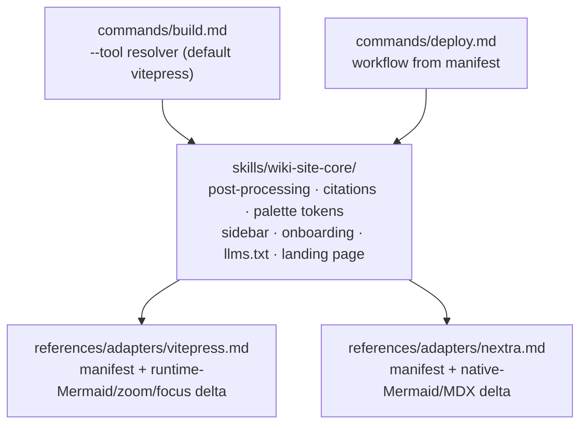

# Plan: Multi-tool wiki packaging — shared core + adapter contract

> Track: multi-tool-wiki-packaging-20260624
> Spec: [spec.md](./spec.md)

## Overview

- **Source**: /please:plan
- **Track**: multi-tool-wiki-packaging-20260624
- **Issue**: (set by new-track)
- **Created**: 2026-06-24
- **Approach**: Extract a generator-neutral `wiki-site-core` skill from `wiki-vitepress`, define a declarative adapter-manifest contract, re-express VitePress as the reference adapter, add a Nextra v4 adapter at baseline parity, and parametrize `build`/`deploy` through a tool resolver that reads the manifest.
- **Execution**: code
- **Planned At**: 21048f7

## Purpose

Decouple site packaging from VitePress so the wiki can target multiple documentation generators behind one core + per-tool adapter manifests. This track delivers the contract plus its first two adapters (VitePress reference + Nextra v4), proving the abstraction is generator-neutral.

## Context

The packaging logic lives in `skills/wiki-vitepress/SKILL.md` (overview) and `skills/wiki-vitepress/references/vitepress-build.md` (~650 lines of VitePress-specific config, theme, CSS, post-processing). `commands/build.md` is a thin entrypoint delegating to the skill; `commands/deploy.md` generates a GitHub Actions workflow hardcoding `npm run build`, `wiki/.vitepress/dist`, and VitePress base-path logic. Most of the reference's content — Markdown post-processing, source citations, the dark palette, sidebar/onboarding generation, `llms.txt`/`AGENTS.md` emission, the landing page — is tool-independent and is what the core will own.

The plugin's "source" is Markdown skill/command files; there is no code test suite. Verification is by **smoke-building a representative wiki** through each adapter and diffing VitePress output against the pre-refactor baseline.

### Planning decisions (resolving the spec's deferred questions)

- **Core shape**: introduce a new `skills/wiki-site-core/` skill (SKILL.md + `references/`) holding the tool-independent logic. `wiki-vitepress` is retained as a thin pointer to the core's VitePress adapter so the existing skill name/trigger keeps working.
- **Manifest format**: each adapter is a Markdown reference file under `skills/wiki-site-core/references/adapters/{tool}.md` whose head carries a fenced **YAML manifest block** (the declarative fields) followed by the tool-specific theme/scaffold delta. A Markdown-native manifest fits the plugin's prompt-as-source model; no runtime parser is introduced.
- **Parity verification in v1**: manual smoke build per adapter on a small fixture wiki (one dark Mermaid diagram, a `<T>` generic, a citation, an onboarding page), plus a VitePress before/after diff. The automated golden-fixture harness stays deferred.

## Architecture Decision

Single core + thin adapter manifests, with VitePress as a non-privileged reference adapter. Rejected alternatives: (a) per-tool skill forks — multiplies the ~650-line reference and the deploy workflow per tool; (b) keeping VitePress privileged and bolting Nextra on beside it — leaves the "neutral" core encoding VitePress assumptions, which the spec's regression bar (FR-007) exists to prevent. The manifest is the single source of truth for tool-specific values, read identically by build, deploy, and CI (FR-004).

## Architecture Diagram



## Tasks

- [x] T001 Define the adapter-manifest contract and core/adapter skill layout (file: skills/wiki-site-core/SKILL.md) (file: skills/wiki-site-core/references/adapter-contract.md)
  STOP: if the manifest fields can't express VitePress's base-path editing of config.mts declaratively, surface it before extraction — the contract shape changes.
- [x] T002 Extract the tool-independent core from vitepress-build.md into wiki-site-core references (post-processing, citations, palette/font tokens, sidebar+onboarding, llms.txt/AGENTS.md emission, landing page) (file: skills/wiki-site-core/references/core-packaging.md) (depends on T001)
  STOP: if a "tool-independent" rule turns out to depend on VitePress specifics (e.g. the `<br/>`→`<br>` fix is markdown-it-only), classify it as a parser_profile concern in the adapter, not the core.
- [x] T003 Re-express VitePress as the reference adapter — vitepress manifest + VitePress-only delta (config.mts, theme/index.ts zoom+focus, custom.css, runtime Mermaid three-layer fix) (file: skills/wiki-site-core/references/adapters/vitepress.md) (depends on T002)
  STOP: VitePress smoke build must be behavior-identical to the pre-refactor baseline (FR-007); if any diff in theme, Mermaid, zoom, focus, or structure appears, stop and reconcile before continuing.
- [x] T004 [P] Add the Nextra v4 adapter at baseline parity — nextra manifest + token mapping (dark theme), native Mermaid wiring, citation rendering, sidebar/onboarding structure; declare zoom/focus as absent (file: skills/wiki-site-core/references/adapters/nextra.md) (depends on T002, T001)
  STOP: if generated pages contain bare `<T>` generics that break Nextra MDX, the parser_profile must emit `.md`/escape — confirm the core's post-processing covers it rather than hand-fixing pages.
- [x] T005 Add an explicit --tool selector to build.md (default vitepress) that loads the core + chosen adapter (file: commands/build.md) (depends on T003, T004)
- [x] T006 Parametrize deploy.md from the chosen adapter's manifest — build command, output dir, Node version, base-path mechanism, extra files (.nojekyll) — replacing the hardcoded VitePress workflow (file: commands/deploy.md) (depends on T001, T005)
  STOP: keep the default (no --tool) deploy workflow byte-equivalent to today's VitePress workflow; a changed default would silently break existing users' Pages deploys.
- [x] T007 Update docs to reflect multi-tool packaging — wiki-vitepress as a thin pointer to the core, README skills/commands tables, and the adapter-contributor note (file: skills/wiki-vitepress/SKILL.md) (file: README.md) (depends on T003, T004, T005, T006)

## Dependencies

```
T001 → T002 → T003 ┐
T001 ┬→ T004 ───────┼→ T005 → T006 → T007
T002 ┘              ┘
```

T004 is parallel-capable with T003 once T001+T002 land (both build on the core; neither depends on the other).

## Key Files

- `skills/wiki-vitepress/SKILL.md` — current packaging overview; becomes a thin pointer to the core's VitePress adapter.
- `skills/wiki-vitepress/references/vitepress-build.md` — ~650-line VitePress reference; source of the extraction (core vs VitePress-specific delta).
- `commands/build.md` — thin entrypoint; gains the `--tool` resolver.
- `commands/deploy.md` — hardcoded VitePress workflow; becomes manifest-parametrized.
- `README.md` — pipeline/commands/skills tables to update for multi-tool packaging.
- (new) `skills/wiki-site-core/SKILL.md` + `references/` — the generator-neutral core, adapter contract, and per-tool adapter manifests.

## Verification

- VitePress before/after: build a representative wiki on the pre-refactor commit and on this branch; the produced sites are equivalent (dark theme, Mermaid, click-to-zoom, focus mode, structure) — FR-007, SC-002.
- Nextra baseline parity: the same wiki builds through the Nextra adapter with shared dark palette, native dark Mermaid, intact citations, sidebar/onboarding — FR-008, SC-003.
- Single source of truth: grep build/deploy/CI for `vitepress`, `npm run build`, `.vitepress/dist`, base-path literals — none appear outside an adapter manifest — FR-004, SC-004.
- Capability declaration: the Nextra adapter declares zoom/focus absent and its build still succeeds — FR-009, AC-003.
- Selector default: invoking build/deploy with no `--tool` resolves to VitePress — FR-010, AC-004.

## Test Scenarios

### T001
Test expectation: none — contract/schema authoring. Verified by review: the manifest fields (install_cmd, build_cmd, output_dir, mermaid_strategy, dark_mode, node_version, base_path_mechanism, parser_profile, extra_files) cover every tool-specific value currently hardcoded in build.md/deploy.md/vitepress-build.md.

### T002
- Happy: a fixture wiki processed through the extracted core → post-processing, citations, palette tokens, sidebar/onboarding, llms.txt all produced, identical to the pre-extraction output of the same steps.
- Edge: a page with a bare `<T>` generic and a `<br/>` → the core's post-processing classifies these by parser_profile (not hardcoded to markdown-it).
- Verification: the core reference contains no `vitepress`/`config.mts`/`.vitepress` literal.

### T003
- Happy: VitePress adapter builds the fixture wiki → site is behavior-identical to the pre-refactor baseline (theme, Mermaid dark, zoom, focus, structure).
- Integration: `build` with no `--tool` and `deploy` with no `--tool` both resolve VitePress and reproduce today's output/workflow.
- Error: if the VitePress delta references a core token that doesn't exist, the build fails loudly (not a silent fallback).

### T004
- Happy: Nextra adapter builds the fixture wiki → shared dark palette applied, Mermaid renders dark via Nextra native, citation links resolve, onboarding-first sidebar present.
- Edge: page with bare `<T>` generic builds under Nextra (parser_profile handled), no manual page edits.
- Error/declaration: zoom/focus declared absent → build succeeds and reports the capability gap rather than failing (AC-003).

### T005
- Happy: `build --tool nextra` loads core + nextra adapter; `build` (no arg) loads core + vitepress.
- Error: `build --tool unknown` fails with a clear message naming available adapters.

### T006
- Happy: `deploy --tool nextra` emits a workflow using Nextra's build command, output dir, Node version, and `.nojekyll`.
- Edge: `deploy` (no arg) emits a workflow byte-equivalent to today's VitePress workflow.
- Verification: deploy.md contains no `wiki/.vitepress/dist` or `npm run build` outside the VitePress manifest.

### T007
Test expectation: none — documentation. Verified by review: README and wiki-vitepress SKILL.md describe the core + adapter model, list VitePress and Nextra as adapters, and point contributors at the adapter contract; no stale "VitePress-only" claims remain.

## Progress

- T001 ✅ — Authored `skills/wiki-site-core/SKILL.md` (core + adapter overview, reference map) and `references/adapter-contract.md` (manifest schema: install/build/output/node/mermaid_strategy/parser_profile/dark_mode/base_path/extra_files/capabilities; Mermaid strategies, parser profiles, base-path mechanisms, capability tiers, consumption rules, add-an-adapter guide). STOP check cleared — VitePress base-path expressed declaratively as `base_path.kind: config-edit`. Commit: T001.
- T002 ✅ — Authored `references/core-packaging.md`: common output structure, design tokens (canonical palette/fonts), developer-focused landing page, plain-Markdown citations, sidebar+onboarding spec, llms.txt/AGENTS.md emission, and the profile-keyed post-processing catalog. STOP cleared — transforms gated by `parser_profile`/`mermaid_strategy` (e.g. `<br/>`→`<br>` = markdown-it; Mermaid inline-style fix = runtime), classified not duplicated. Note: VitePress mentions in the core are cross-ref pointers/boundary examples, not core logic. Commit: T002.
- T003 ✅ — Authored `references/adapters/vitepress.md`: manifest (runtime Mermaid, markdown-it, config-edit base path, all capabilities true) + core/adapter split + delta classification (config.mts, theme/index.ts zoom+focus, custom.css, three-layer Mermaid fix mapped across core/adapter). STOP cleared — VitePress build code in `wiki-vitepress/references/vitepress-build.md` is untouched, so FR-007 behavior-identity holds by construction; the adapter is a manifest+classification layer over it. Smoke-build confirmation deferred. Commit: T003.
- T004 ✅ — Authored `references/adapters/nextra.md`: manifest (native Mermaid, mdx, next-config base path, Node 22, `out/` + `.nojekyll`, zoom/focus false) + scaffold delta (package.json, next.config with `@theguild/remark-mermaid` + `output: export`, token→CSS-var mapping forced dark, `_meta` nav from core spec). STOP cleared — bare `<T>` handled by core `mdx` profile (escape + emit `.md`), no per-page hand-fixes. Baseline-parity gaps (zoom/focus) declared honestly. Smoke build deferred. Commit: T004.
- T005 ✅ — Rewrote `commands/build.md` as a generator-neutral entrypoint: resolves `--tool <name>` → default `vitepress`; loads `wiki-site-core` + chosen adapter; unknown tool → list available. No-arg default reproduces today's VitePress build (regression-safe). Points at the unchanged `vitepress-build.md` for the full VitePress code. Commit: T005.
- T006 ✅ — Rewrote `commands/deploy.md` to read the adapter manifest: `{node_version}`/`{build_cmd}`/`{output_dir}` placeholders, conditional `.nojekyll` step from `extra_files`, and base-path injection by `base_path.kind` (config-edit/next-config/env). STOP cleared — vitepress manifest (Node 20, npm run build, .vitepress/dist, empty extra_files) yields a **behavior-equivalent** default workflow (same Node/build/output/base-path; the extra-files step is omitted when empty). Note: the generated YAML differs cosmetically from the old one (generic `name: Build` vs `Build with VitePress`), so the deploy *workflow* is behavior- not byte-equivalent; the built *site* output stays byte-identical since vitepress-build.md is unchanged. SC-004's grep target is the generated workflow, not the deploy.md prose examples (which legitimately cite `npm run build`/`.vitepress/dist` to explain the field mapping). Commit: T006.
- T007 ✅ — `skills/wiki-vitepress/SKILL.md` rewritten as the VitePress adapter entry (thin pointer to wiki-site-core core + adapter contract + vitepress adapter; keeps trigger; vitepress-build.md remains authoritative code). README updated: build command (multi-tool, `--tool`), skills table (+wiki-site-core), How It Works step 4, pipeline diagram, and plugin structure tree (wiki-site-core subtree). Commit: T007.
- [x] (2026-06-24) Review fixes applied (SHA: `6f3c760`) — spec-compliance review returned 11/11 IMPLEMENTED, no Critical/PARTIAL. Fixed: README build.md tree comment (T007 stale-claim gap), deploy.md extra-files step made explicitly conditional + iterating `extra_files`, and "byte-equivalent" → "behavior-equivalent" reconciliation for the deploy workflow.

## Decision Log

- Core is a new `wiki-site-core` skill; `wiki-vitepress` becomes a thin pointer (keeps the existing skill trigger working).
- Manifests are YAML blocks at the head of per-adapter Markdown reference files — Markdown-native, no runtime parser.
- v1 parity verification is manual smoke builds + a VitePress before/after diff; the automated golden-fixture harness is deferred.

## Surprises & Discoveries

_(updated during implementation)_
