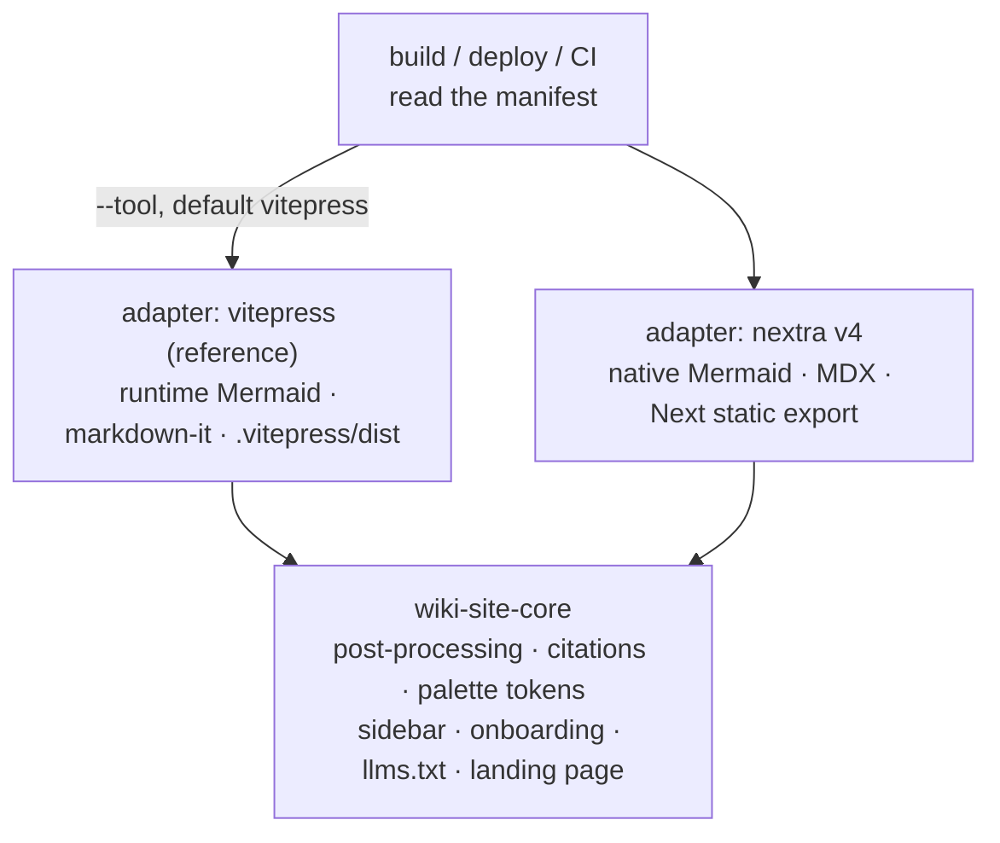

# Multi-tool wiki packaging: shared core + adapter contract

## Summary

Refactor the VitePress packaging into a generator-neutral core plus thin per-tool **adapter manifests**, and prove the split by shipping two adapters in v1 — VitePress (behavior-unchanged) as the reference and Nextra v4 as a maximally-different second tool — with one manifest driving build, deploy, and CI alike.

---

## Problem Frame

Site packaging is welded to VitePress. The authoritative spec, `skills/wiki-vitepress/references/vitepress-build.md`, is ~650 lines of VitePress-specific config, theme, CSS, and post-processing; `commands/deploy.md` hardcodes `npm run build`, the artifact path `wiki/.vitepress/dist`, and VitePress base-path logic; `commands/build.md` delegates to the one skill.

Supporting another generator today means cloning that ~650-line reference and forking the deploy workflow — and then keeping every copy in sync as each cross-cutting fix (the dark-Mermaid handling, the citation format, the palette) lands. The cost of "N tools" is N forks, not N descriptors. Yet most of what the skill does — post-processing, citations, the dark palette, sidebar generation, `llms.txt` emission — is tool-independent and already separated from the VitePress-specific reference in spirit. The structure is asking to be split.

---

## Key Decisions

- **Shared core + thin adapter manifests, not N skill forks.** Tool-independent logic lives in one core; each tool is a small declarative descriptor. This converts "support N tools" from N copies of a ~650-line reference into one engine + N manifests, so every cross-cutting fix propagates once.
- **The manifest is the contract, read identically by build, deploy, and CI.** A single declarative source of tool-specific values removes the hardcoding from `deploy.md` and keeps the three consumers from drifting.
- **VitePress is the reference adapter, not a privileged substrate.** Re-expressing VitePress against the same contract is the discipline that stops the "neutral" core from silently encoding VitePress quirks. If VitePress can't be an ordinary adapter, the abstraction isn't real.
- **v1 ships VitePress + Nextra v4 — two maximally-contrasting adapters.** Nextra differs from VitePress on framework (React vs Vue), dialect (MDX vs markdown-it), and Mermaid strategy (build-time/native vs runtime). Its built-in Mermaid means zero Mermaid code, so a green build proves the *contract* rather than a Mermaid re-implementation — and it exercises the build-time Mermaid path VitePress can't.
- **Baseline parity is the "supported" bar.** A new adapter must reproduce the content-level signature (dark theme via tokens, dark Mermaid, intact citations, sidebar/onboarding structure). Click-to-zoom and focus mode stay declared VitePress-tier extras.
- **v1 implements only the manifest values its two adapters need.** The generalized Mermaid-strategy slot and the multi-dialect Markdown normalizer are separate tracks; v1 proves the contract carries them as fields.

---

## Requirements

**Generator-neutral core**

- R1. A generator-neutral core holds the tool-independent packaging logic: Markdown post-processing, source-linked citations, the dark palette and fonts as design tokens, dynamic sidebar with onboarding-first ordering, `llms.txt` / `llms-full.txt` / `AGENTS.md` emission, and the developer-focused landing page.
- R2. Cross-cutting fixes and palette/token changes are made once in the core and apply to every adapter; no adapter re-implements core logic.

**Adapter contract**

- R3. Each supported tool is expressed as one declarative adapter manifest capturing at minimum: install command, build command, output directory, Mermaid strategy, dark-mode handling, required Node version, base-path mechanism, content/parser profile, and extra emitted files (e.g. `.nojekyll`).
- R4. `build`, `deploy`, and any CI read the same manifest as the single source of truth for tool-specific values; none of them hardcode a tool's build command, output directory, or base-path logic.
- R5. The manifest defines `mermaid_strategy` and `parser_profile` as fields. v1 implements only the values its two adapters use — Mermaid `runtime` (VitePress) and `native` (Nextra); parser `markdown-it` (VitePress) and `mdx` (Nextra). Other values are reserved for follow-up adapters.

**VitePress as reference adapter**

- R6. VitePress is re-expressed as the reference adapter against the contract, with no privileged path through the core.
- R7. Today's `/deep-wiki:build` output is behavior-identical after the refactor — same dark theme, dark Mermaid, click-to-zoom, focus mode, and structure. This is the regression bar and the honesty check on the core's neutrality.

**Second adapter and parity**

- R8. A Nextra v4 adapter ships in v1 at baseline parity: it renders the wiki with the dark theme via the shared palette tokens, dark Mermaid (Nextra native), intact source citations, and sidebar + onboarding structure.
- R9. Click-to-zoom and focus mode are declared VitePress-tier capabilities, not required of every adapter; each adapter declares which of them it provides.

**Selection and deploy**

- R10. `build` and `deploy` resolve the target tool via an explicit selector (e.g. a `--tool` argument) defaulting to VitePress; passing nothing yields today's behavior.
- R11. `deploy` generates a workflow parameterized from the chosen adapter's manifest (build command, output directory, Node version, base-path mechanism, extra files), replacing the VitePress-hardcoded workflow.

---

## Acceptance Examples

- AE1. **Covers R7.** Given an existing generated wiki, when a user runs `/deep-wiki:build` with no tool argument after the refactor, then the produced site is behavior-identical to the pre-refactor VitePress output (dark theme, dark Mermaid, click-to-zoom, focus mode, structure).
- AE2. **Covers R8, R5.** Given the same generated wiki, when a user builds with the Nextra adapter, then the site renders with the shared dark palette, Mermaid diagrams in dark mode via Nextra's native rendering, working source-citation links, and the onboarding-first sidebar — with no VitePress-specific Mermaid post-processing applied.
- AE3. **Covers R9.** Given the Nextra adapter without click-to-zoom, when the site is built, then the build succeeds and the adapter's declared capabilities reflect that zoom/focus are absent — their absence is not a failure.
- AE4. **Covers R10, R11.** Given a chosen non-default tool, when `deploy` runs, then the generated workflow uses that adapter's build command, output directory, and Node version from the manifest — not `wiki/.vitepress/dist` or `npm run build` by assumption.

---

## Scope Boundaries

**Deferred for later**

- Fumadocs, Docusaurus, and Docus adapters — drop in against the proven contract as follow-up tracks.
- **Starlight + `astro-mermaid` is the named first follow-up adapter.** Now low-friction: `astro-mermaid` renders Mermaid client-side (no Playwright), auto-switches dark/light via `data-theme`, and has documented Starlight support. It extends the contract's proof to a third framework family (Astro).
- The generalized Mermaid-strategy slot (build-time pre-render path beyond Nextra's native) and the multi-dialect Markdown normalizer (MDX `<T>` escaping, Docus MDC `---` guarding) — separate ideation survivors.
- Auto-detect / content-aware tool recommendation — v1 uses explicit selection.
- A golden-fixture parity CI harness and the no-build zero-dependency preview tier — separate tracks.

**Outside this product's identity**

- No change to the wiki generation pipeline (catalogue → pages → onboarding). This track repackages the existing generated Markdown; it does not alter how that Markdown is produced.

---

## Dependencies / Assumptions

- The generated wiki Markdown is the shared input to every adapter; adapters consume the same pages the core normalizes.
- Tool-version facts the manifest encodes are treated as planning-time confirmations: Nextra v4 static export + built-in Mermaid via `@theguild/remark-mermaid` and its Node requirement; VitePress 1.x on Node 20. Confirm exact versions during planning.
- Follow-up de-risking recorded so the next adapter inherits it: Starlight Mermaid via `astro-mermaid` (client-side, MIT, actively released as of mid-2026) rather than `rehype-mermaid` (which needs a headless browser).
- Source citations are emitted as plain Markdown links today, which are tool-neutral; confirm Nextra renders them intact under baseline parity.

---

## Outstanding Questions

**Deferred to planning**

- Exact manifest format and file layout (YAML vs skill frontmatter; where adapters live relative to `skills/wiki-vitepress/`).
- How the core is packaged — a new `wiki-site-core` skill versus a restructured `wiki-vitepress` — and how `build.md`, `deploy.md`, and the skill reference it.
- How baseline parity is verified in v1 (manual check vs a minimal smoke build), given the full golden-fixture harness is deferred.
